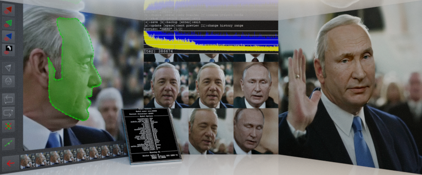



.

#deepfakes #faceswap #face-swap #deep-learning #deeplearning #deep-neural-networks #deepface #deep-face-swap #fakeapp #fake-app #neural-networks #neural-nets

## **DeepFaceLab** is a tool that utilizes machine learning to replace faces in videos.
 
GOAL: next DeepFacelab update.

- ### [Gallery](doc/gallery/doc_gallery.md)

- ### Manuals:

[English (google translated)](doc/manual_en_google_translated.pdf)

- ### [Prebuilt windows app](doc/doc_prebuilt_windows_app.md)

- ### Forks

[Google Colab fork](https://github.com/chervonij/DFL-Colab) by @chervonij

[Linux fork](https://github.com/lbfs/DeepFaceLab_Linux) by @lbfs - may be outdated

- ### [Ready to work facesets](doc/doc_ready_to_work_facesets.md)

- ### [Build and repository info](doc/doc_build_and_repository_info.md)
