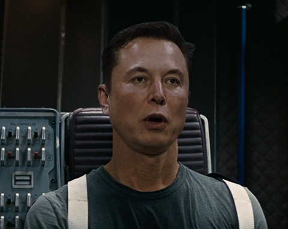

<table align="center" border="0">

<tr><td colspan=2 align="center">

# DeepFaceLab  

<a href="https://arxiv.org/abs/2005.05535">

</img>
https://arxiv.org/abs/2005.05535</a>

### deepfakes oluşturmak için lider yazılım

</td></tr>
<tr><td colspan=2 align="center">

Deepfake videoların %95'inden fazlası DeepFaceLab ile oluşturulmuştur.

DeepFaceLab, aşağıdaki popüler youtube kanalları tarafından kullanılmaktadır.

| [deeptomcruise](https://www.tiktok.com/@deeptomcruise)| [1facerussia](https://www.tiktok.com/@1facerussia)| [arnoldschwarzneggar](https://www.tiktok.com/@arnoldschwarzneggar)
|---|---|---|

| [mariahcareyathome?](https://www.tiktok.com/@mariahcareyathome?)| [diepnep](https://www.tiktok.com/@diepnep)| [mr__heisenberg](https://www.tiktok.com/@mr__heisenberg)| [deepcaprio](https://www.tiktok.com/@deepcaprio)
|---|---|---|---|

| [VFXChris Ume](https://www.youtube.com/channel/UCGf4OlX_aTt8DlrgiH3jN3g/videos)| [Sham00k](https://www.youtube.com/channel/UCZXbWcv7fSZFTAZV4beckyw/videos)|
|---|---|

| [Collider videos](https://www.youtube.com/watch?v=A91P2qtPT54&list=PLayt6616lBclvOprvrC8qKGCO-mAhPRux)| [iFake](https://www.youtube.com/channel/UCC0lK2Zo2BMXX-k1Ks0r7dg/videos)| [NextFace](https://www.youtube.com/channel/UCFh3gL0a8BS21g-DHvXZEeQ/videos)|
|---|---|---|

| [Futuring Machine](https://www.youtube.com/channel/UCC5BbFxqLQgfnWPhprmQLVg)| [RepresentUS](https://www.youtube.com/channel/UCRzgK52MmetD9aG8pDOID3g)| [Corridor Crew](https://www.youtube.com/c/corridorcrew/videos)|
|---|---|---|

| [DeepFaker](https://www.youtube.com/channel/UCkHecfDTcSazNZSKPEhtPVQ)| [DeepFakes in movie](https://www.youtube.com/c/DeepFakesinmovie/videos)|
|---|---|

| [DeepFakeCreator](https://www.youtube.com/channel/UCkNFhcYNLQ5hr6A6lZ56mKA)| [Jarkan](https://www.youtube.com/user/Jarkancio/videos)|
|---|---|

</td></tr>

<tr><td colspan=2 align="center">

# DeepFaceLab'ı kullanarak ne yapabilirim?

</td></tr>
<tr><td colspan=2 align="center">

## Yüz değiştirme

</td></tr>

<tr><td colspan=2 align="center">

## Yüzü yaşlandırma

</td></tr>

<tr><td align="center" width="50%">

</td>
<td align="center" width="50%">

</td></tr>

<tr><td colspan=2 align="center">

 https://www.youtube.com/watch?v=Ddx5B-84ebo

</td></tr>

<tr><td colspan=2 align="center">

## Kafa değiştirme

</td></tr>

<tr><td align="center" width="50%">

</td>
<td align="center" width="50%">

</td></tr>

<tr><td colspan=2 align="center">

 https://www.youtube.com/watch?v=xr5FHd0AdlQ

</td></tr>

<tr><td align="center" width="50%">

</td>
<td align="center" width="50%">

</td></tr>

<tr><td colspan=2 align="center">

 https://www.youtube.com/watch?v=RTjgkhMugVw

</td></tr>

<tr><td align="center" width="50%">

</td>
<td align="center" width="50%">

</td></tr>

<tr><td colspan=2  align="center">

 https://www.youtube.com/watch?v=R9f7WD0gKPo

</td></tr>

<tr><td colspan=2 align="center">

## Politikacıların dudak haraketlerini değiştirme
(ses değiştirme dahil değildir!)
(Adobe After Effects veya Davinci Resolve gibi video düzenleyiciler de beceri gerektirir)

 https://www.youtube.com/watch?v=IvY-Abd2FfM

 https://www.youtube.com/watch?v=ERQlaJ_czHU

</td></tr>
<tr><td colspan=2 align="center">

# Deepfake çözünürlük ilerlemesi

</td></tr>
<tr><td colspan=2 align="center">

</td></tr>
<tr><td colspan=2 align="center">

Ne yazık ki DeepFaceLab'de "her şeyi yoluna koy" düğmesi yok. İş akışını incelemek ve becerilerinizi geliştirmek için zaman harcamalısınız. AfterEffects veya Davinci Resolve gibi programlarda bir beceri gerekebilir.

</td></tr>
<tr><td colspan=2 align="center">

## Mini öğretici

</td></tr>
<tr><td colspan=2 align="center">

## Sürümleri

</td></tr>

<tr><td align="right">
<a href="https://tinyurl.com/2p9cvt25">Windows (magnet link)</a>
</td><td align="center">Son sürüm. İndirmek için torrent kullanın..</td></tr>

<tr><td align="right">
<a href="https://mega.nz/folder/Po0nGQrA#dbbttiNWojCt8jzD4xYaPw">Windows (Mega.nz)</a>
</td><td align="center">Yeni ve önceki sürümleri içerir.</td></tr>

<tr><td align="right">
<a href="https://disk.yandex.ru/d/7i5XTKIKVg5UUg">Windows (yandex.ru)</a>
</td><td align="center">Yeni ve önceki sürümleri içerir.</td></tr>

<tr><td align="right">

</td><td align="center"> tarafından @chervonij . Google Colab'ı kullanarak yüzleri değiştirmeyi ücretsiz olarak deneyebilirsiniz.</td></tr>

<tr><td align="right">
<a href="https://github.com/nagadit/DeepFaceLab_Linux">Linux (github)</a>
</td><td align="center">tarafından @nagadit</td></tr>

<tr><td align="right">
<a href="https://github.com/elemantalcode/dfl">CentOS Linux (github)</a>
</td><td align="center">modası geçmiş olabilir. Tarafından @elemantalcode</td></tr>

</table>

<table align="center" border="0">

<tr><td colspan=2 align="center">

## Linkler

</td></tr>

<tr><td colspan=2 align="center">

### Kılavuzlar ve öğreticiler

</td></tr>

<tr><td align="right">
<a href="https://mrdeepfakes.com/forums/thread-guide-deepfacelab-2-0-guide">DeepFaceLab kılavuz</a>
</td><td align="center">Ana Rehber</td></tr>

<tr><td align="right">
<a href="https://mrdeepfakes.com/forums/thread-guide-deepfacelab-2-0-guide?pid=18459#pid18459">Faceset creation kılavuz</a>
</td><td align="center">Doğru yüz seti nasıl oluşturulur</td></tr>

<tr><td align="right">

</td><td align="center">Google Colab'da yüz değiştirmeyi nasıl öğreneceğiniz konusunda rehberlik edinin</td></tr>

<tr><td align="right">
<a href="https://mrdeepfakes.com/forums/thread-deepfacelab-2-0-compositing-in-davinci-resolve-vegas-pro-and-after-effects">Kompozisyon</a>
</td><td align="center">En yüksek kaliteyi elde etmek için Davinci Resolve veya Adobe AfterEffects gibi video düzenleyicilerde manuel olarak deepfake oluşturun</td></tr>

<tr><td align="right">
<a href="https://mrdeepfakes.com/forums/thread-deepfacelab-2-0-discussion-tips-suggestions">Tartışma ve öneriler</a>
</td><td align="center"></td></tr>

<tr><td colspan=2 align="center">

### Ek materyal

</td></tr>

<tr><td align="right">
<a href="https://mrdeepfakes.com/forums/forum-celebrity-facesets">facesets çalışmaya hazır</a>
</td><td align="center">Topluluk tarafından yapılan ünlü yüzler</td></tr>

<tr><td align="right">
<a href="https://mrdeepfakes.com/forums/forum-trained-models">Önceden yapılmış modeller</a>
</td><td align="center">Topluluk tarafından yapılan önceden yapılmış modeller</td></tr>

<tr><td colspan=2 align="center">

### İletişim grupları

</td></tr>

<tr><td align="right">
<a href="https://discord.gg/rxa7h9M6rH">Discord</a>
</td><td align="center">Resmi discord kanalı. İngilizce/Rusça.</td></tr>

<tr><td align="right">
<a href="https://t.me/joinchat/ElkhqlgJ0I5HhdJyFar80w">Telegram grubu</a>
</td><td align="center">Resmi telegram grubu. İngilizce/Rusça. Anonim iletişim için Telefon numaranızı gizlemeyi unutmayın</td></tr>

<tr><td align="right">
<a href="https://mrdeepfakes.com/forums/forum-russian-community">Русский форум</a>
</td><td align="center"></td></tr>

<tr><td align="right">
<a href="https://mrdeepfakes.com/forums/">mrdeepfakes</a>
</td><td align="center">en büyük NSFW İngilizce topluluğu</td></tr>

<tr><td align="right">
<a href="https://www.reddit.com/r/DeepFakesSFW/new/">reddit r/DeepFakesSFW/</a>
</td><td align="center">Deepfake'lerinizi buraya gönderin!</td></tr>

<tr><td align="right">
<a href="https://www.reddit.com/r/RUdeepfakes/new/">reddit r/RUdeepfakes/</a>
</td><td align="center">Постим русские дипфейки сюда !</td></tr>

<tr><td align="right">
QQ群124500433
</td><td align="center">中文交流QQ群，商务合作找群主</td></tr>

<tr><td align="right">
<a href="https://www.dfldata.xyz">dfldata.xyz</a>
</td><td align="center">中文交流论坛，免费软件教程、模型、人脸数据</td></tr>

<tr><td align="right">
<a href="https://www.deepfaker.xyz/">deepfaker.xyz</a>
</td><td align="center">中文学习站（非官方)</td></tr>

<tr><td colspan=2 align="center">

## İlgili işler

</td></tr>

<tr><td align="right">
<a href="https://github.com/iperov/DeepFaceLive">DeepFaceLive</a>
</td><td align="center">Bilgisayar aramaları veya görüntülü aramalar için gerçek zamanlı yüz değiştirme.</td></tr>

<tr><td align="right">
<a href="https://github.com/neuralchen/SimSwap">neuralchen/SimSwap</a>
</td><td align="center">Tek fotoğraf kullanarak yüz değiştirme. 一张图免训练换脸</td></tr>

<tr><td align="right">
<a href="https://github.com/deepfakes/faceswap">deepfakes/faceswap</a>
</td><td align="center">DeepFaceLab'den önce olan ve hala geçmişte kalan bir şey</td></tr>

</td></tr>
</table>

<table align="center" border="0">

<tr><td colspan=2 align="center">

## Projeye nasıl yardımcı olabilirim?

</td></tr>

<tr><td colspan=2 align="center">

### Deepfake araştırmalarına ve DeepFaceLab geliştirmesine sponsor olarak.

</td></tr>
<!--
<tr><td colspan=2 align="center">
<a href="https://www.paypal.com/paypalme/DeepFaceLab">Aracılığıyla bağış yapın; Paypal</a>
</td></tr>
-->
<tr><td colspan=2 align="center">
<a href="https://money.yandex.ru/to/41001142318065">Aracılığıyla bağış yapın; Yandex.Money</a>
</td></tr>

<tr><td colspan=2 align="center">
bitcoin:bc1qkhh7h0gwwhxgg6h6gpllfgstkd645fefrd5s6z
</td></tr>

<tr><td colspan=2 align="center">

### Yüz setlerini topla

</td></tr>

<tr><td colspan=2 align="center">

DeepFaceLab'de kullanılabilecek herhangi bir ünlünün yüz setini toplayabilir ve toplulukta paylaşabilirsiniz. <a href="https://mrdeepfakes.com/forums/forum-celebrity-facesets">in the community</a>
</td></tr>

<tr><td colspan=2 align="center">

### Bu depoya yıldız ekle

</td></tr>

<tr><td colspan=2 align="center">

Github hesabını kaydedin ve "Yıldız" düğmesine basın.

</td></tr>

</table>

<table align="center" border="0">
<tr><td colspan=2 align="center">

## Meme ler

</td></tr>

<tr><td align="center" width="50%">

</td>

<td align="center" width="50%">

</td></tr>

<tr><td colspan=2>

</td></tr>

<tr><td align="center" width="50%">

## Deepfake dedektörüne ihtiyacınız yok. Yalan söylemeyi bırakmalısın.

</td><td align="center" width="10%">

V.I. Lenin
</td></tr>

<tr><td colspan=2 align="center">

#deepfacelab #deepfakes #faceswap #face-swap #deep-learning #deeplearning #deep-neural-networks #deepface #deep-face-swap #fakeapp #fake-app #neural-networks #neural-nets #tensorflow #cuda #nvidia

</td></tr>

</table>
